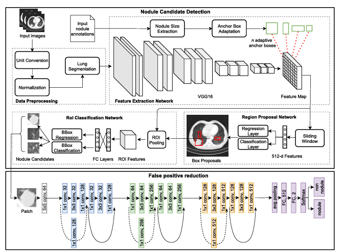

# Lung Nodule Detection with Faster R-CNN + Adaptive Anchors + FPR Classifier

This project implements a **Lung Nodule Detection** system using a **Faster R-CNN (FRCNN)** model enhanced with **adaptive anchor boxes** and an **FPR classifier** for accurate nodule classification. The model is optimized to detect pulmonary nodules in CT scan images and classify them as either **Nodule** or **Non-Nodule**, with the additional feature of identifying indeterminate cases.

### Table of Contents
- [Overview](#overview)
- [Installation](#installation)
- [Model Architecture](#model-architecture)
- [How It Works](#how-it-works)
- [Usage](#usage)
- [Dependencies](#dependencies)

## Overview

Lung cancer is one of the leading causes of death worldwide. Early detection of lung nodules through CT scans can greatly improve the survival rate. This system leverages Faster R-CNN, a state-of-the-art object detection framework, along with False Positive Rate (FPR) classification to accurately detect lung nodules and classify them.

The key components of the model include:
- **Faster R-CNN**: Detects objects (nodules) in CT scan slices.
- **Adaptive Anchor Boxes**: Adjusts anchor boxes for better detection of lung nodules.
- **FPR Classifier**: Classifies detected objects into **Nodule**, **Non-Nodule**, or **Indeterminate** categories based on the confidence score.

## Installation

### Clone the repository:

```bash
git clone https://github.com/yourusername/lung-nodule-detection.git
cd lung-nodule-detection
```

### Install dependencies:

```bash
pip install -r requirements.txt
```

Make sure you have **Python 3.7+** installed. This project also requires a GPU (CUDA) for optimal performance, though it will also work on CPU.

### Model Weights:

Download the pre-trained model (`frcnn_fpr_detector.pt`) and place it in the `models/` directory. You can find the model weight file on this link [Download Model Weights](https://drive.google.com/file/d/1cGZzqhQz8sM1dQ248-8qlA8dnqNNOuGt/view?usp=drive_link)

## Model Architecture



### Key Components:
1. **Backbone Network** (ResNet): Extracts features from input CT images.
2. **Region Proposal Network (RPN)**: Proposes candidate regions for potential nodules.
3. **Anchor Boxes**: Fine-tuned to adapt to the specific size and shape of pulmonary nodules.
4. **FPR Classifier**: Classifies each proposed region into **Nodule**, **Non-Nodule**, or **Indeterminate** based on its confidence score.

## How It Works

1. **Image Preprocessing**: The input image (CT scan slice) is preprocessed using the `letterbox` function to resize it while maintaining the aspect ratio.
2. **Model Inference**: The Faster R-CNN model is used to detect regions that may contain nodules.
3. **FPR Classification**: For each detected region, a False Positive Rate classifier evaluates the confidence and classifies the object as **Nodule**, **Non-Nodule**, or **Indeterminate**.
4. **Bounding Boxes**: Detected regions are drawn with bounding boxes and the classification result is displayed.

## Usage

### Running the Application:

1. Start the Streamlit app:

```bash
streamlit run app.py
```

2. Upload a **CT scan slice** in PNG or JPG format via the user interface.
3. The app will display the uploaded image with detected nodules highlighted by bounding boxes. The classification results will be shown below the image.

### Example Output:

The image will be displayed with bounding boxes around detected nodules, and each box will have a label indicating whether the region is a **Nodule**, **Non-Nodule**, or **Indeterminate**.

## Dependencies

- Python 3.7+
- PyTorch (for model inference)
- OpenCV (for image processing)
- Streamlit (for web interface)
- Pillow (for image manipulation)
- NumPy (for numerical operations)
- Requests (for HTTP requests)
- YOLOv5 (for object detection)

To install all dependencies, run:

```bash
pip install -r requirements.txt
```
